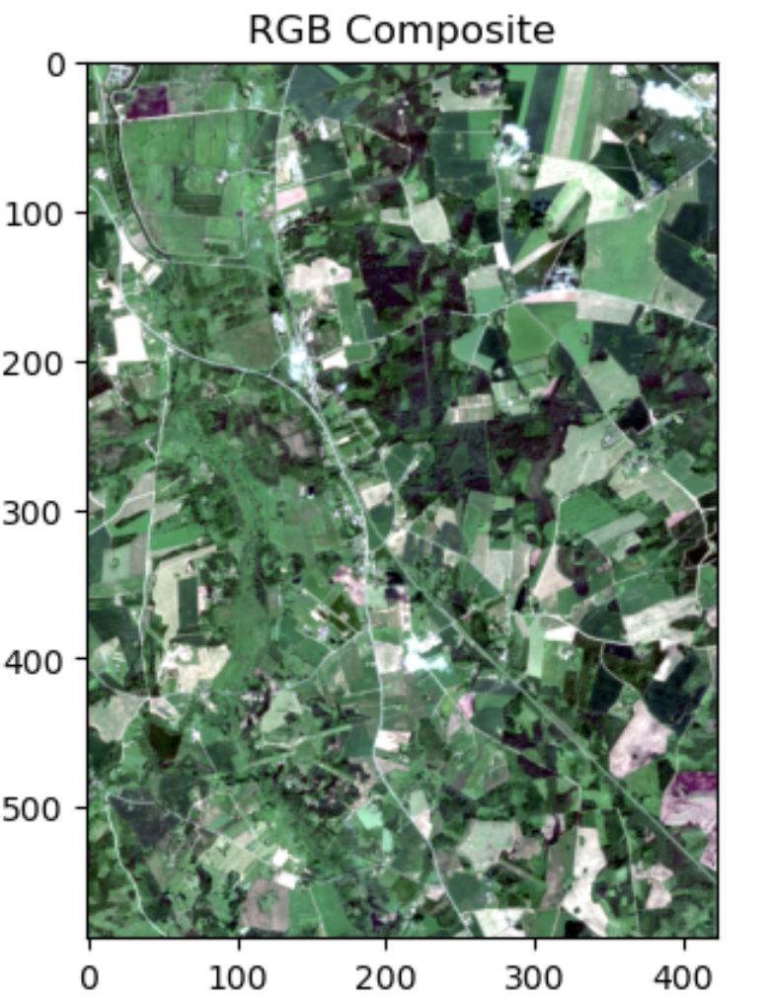
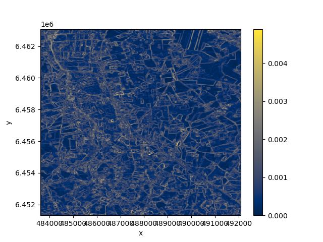

# Spectral Diversity Calculation

## Overview
Calculate Spectral Diversity metrics from Sentinel-2 L2A satellite imagery to assess biodiversity indicators.

Hackathon focus - implement Spectral Rao's Q (Tassi et al. 2022)

### Study Area
**Location:** University of Tartu area, Estonia  
**Bounding Box:**
- Southwest: 26.7212871883497414, 58.2029953574183310
- Northeast: 26.8649178809289140, 58.308324531976389

**Data Source:** Sentinel-2 L2A EOPF Zarr format

### Why It Matters
Spectral diversity is considered a meaningful indicator to assess biodiversity in the scientific literature. By analyzing the spectral properties of satellite imagery, we can derive proxies for ecosystem diversity and health.

### Result

## Background & Literature

### Key Publications

1. **Tassi et al. (2022) - Spectral Rao**  
   [DOI: 10.1016/j.compag.2022.106861](https://doi.org/10.1016/j.compag.2022.106861)  
   GitHub: [AndreaTassi23/spectralrao-monitoring](https://github.com/AndreaTassi23/spectralrao-monitoring)

2. **Thouverai et al. (2021)**  
   [DOI: 10.1016/j.ecolind.2021.108106](https://doi.org/10.1016/j.ecolind.2021.108106)  
   GitHub: [RossiBz/stdiversity](https://github.com/RossiBz/stdiversity)

### Similar Tools
- **R package: biodivMapR** (Note: methodology concerns - needs review), associated publication: https://besjournals.onlinelibrary.wiley.com/doi/10.1111/2041-210X.13310

## Team
- Alex (University of Tartu) @allixender - Project Lead
- Justus @keewis - XArray programming senior expert
- Andy - EO Engineer

## Next Steps
- [ ] Review and validate methodology from existing packages
- [ ] Implement spectral diversity calculations for study area
- [ ] Compare results with ground truth data (if available)
- [ ] Document findings and methodological approach
- More large scale bigger better faster (Dask cluster, gu_vectrorize, numba)
- .persist and cloud data handling considerations

## Notes
Initial idea originated from Alex at the University of Tartu | Landscape Geoinformatics LAb.
