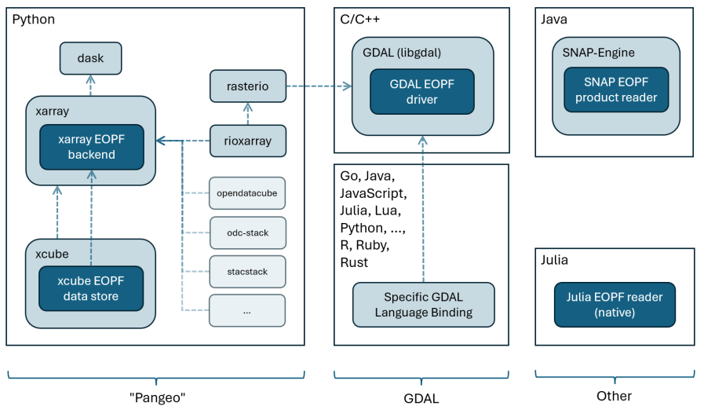

## 🗺️ Overview of EOPF Zarr Plugins

{fig-align="center"}

We build the following plugins:

* xarray EOPF backend
* xcube EOPF data store
* GDAL EOPF driver
* Julia EOPF reader
* SNAP EOPF reader (Prototype for Sentinel-2 L2A)

These plugins can be used in the following visualization framework:

{fig-align="center"}

### What we will learn

- 🔍 What can be done with each plugin.
- 🌳 Current developement state future developement plans of each plugin.
- 🔦 How to access data with each plugin.


### xarray-eopf backend

`xarray-eopf` is a Python package that enhances [xarray](https://docs.xarray.dev/en/stable/user-guide/io.html) by a new backend
named `"eopf-zarr"`. This backend allows for reading the [ESA EOPF data](https://eopf.copernicus.eu/eopf-products-and-adfs/) products
in Zarr format and representing them using analysis ready data models.

After installing `xarray-eopf`, you can open EOPF products with standard xarray functions:

```python
import xarray as xr

dataset = xr.open_dataset(url_or_path, engine="eopf-zarr")
datatree = xr.open_datatree(url_or_path, engine="eopf-zarr")
```

**Modes of operation**

1. Analysis mode (`op_mode="analysis"`): Returns user-friendly, analysis-ready data
   with preprocessing (e.g. band selection, resampling, rectification). This mode
   supports only Sentinel-2 and Sentinel-3 products.
2. Native mode (`op_mode="native"`): Returns a near 1:1 view of the Zarr structure
   with minimal preprocessing.

**🔗 Useful links**

- 🐙 **GitHub:** [EOPF-Sample-Service/xarray-eopf](https://github.com/EOPF-Sample-Service/xarray-eopf)
- 📦 **PyPI:** [xarray-eopf](https://pypi.org/project/xarray-eopf)
- 🐍 **Anaconda:** [xarray-eopf on conda-forge](https://anaconda.org/conda-forge/xarray-eopf)
- 📖 **Documentation:** [xarray-eopf docs](https://eopf-sample-service.github.io/xarray-eopf)
- 📓 **Example notebook:**
    - [Sentinel-2](https://eopf-sample-service.github.io/eopf-sample-notebooks/xarray-eopf-sen2)
    - [Sentinel-3](https://eopf-sample-service.github.io/eopf-sample-notebooks/xarray-eopf-sen3)


### xcube EOPF data store

`xcube-eopf` extends [xcube](https://xcube.readthedocs.io/en/latest) with an
`"eopf-zarr"` data store, enabling the creation of analysis-ready data cubes (ARDC)
from Sentinel products via the [EOPF Sentinel Zarr Samples Service STAC API](https://stac.browser.user.eopf.eodc.eu/?.language=en).

Once installed, you can access EOPF data products through the standard xcube interface
and generate analysis ready data cubes form multiple Sentinel Zarr samples. The
workflow for building 3D analysis-ready cubes from Sentinel-2 products involves
the following steps:

1. **Query** products using the [EOPF STAC API](https://stac.browser.user.eopf.eodc.eu/)
   for a given time range and spatial extent.
2. **Retrieve** observations as cloud-optimized Zarr chunks via the
   [xarray-eopf backend](https://eopf-sample-service.github.io/xarray-eopf/).
3. **Mosaic** spatial tiles into single images per timestamp.
4. **Stack** the mosaicked scenes along the temporal axis to form a 3D cube.

> **Note**
> `xcube-eopf` supports Sentinel-2 and Sentinel-3 products (Sentinel-1 coming soon).

**🔗 Useful links**

- 🐙 **GitHub:** [EOPF-Sample-Service/xcube-eopf](https://github.com/EOPF-Sample-Service/xcube-eopf)
- 📦 **PyPI:** [xcube-eopf](https://pypi.org/project/xcube-eopf)
- 🐍 **Anaconda:** [xcube-eopf on conda-forge](https://anaconda.org/conda-forge/xcube-eopf)
- 📖 **Documentation:** [xcube-eopf docs](https://eopf-sample-service.github.io/xcube-eopf)
- 📓 **Example notebook:**
    - [Sentinel-2](https://eopf-sample-service.github.io/eopf-sample-notebooks/xcube-eopf-sen2)
    - [Sentinel-3](https://eopf-sample-service.github.io/eopf-sample-notebooks/xcube-eopf-sen3)


### GDAL EOPF Driver

A GDAL plugin for reading **EOPF (Earth Observation Processing Framework) Zarr datasets**.

---

**✨ Key Features**

- **Seamless QGIS integration** – Works directly with *Add Raster Layer*
- **Smart geospatial handling** – Automatic CRS and geotransform detection (crucial for QGIS workflows)
- **Optimized performance** – Built-in caching, lazy loading, and block prefetching
- **Cloud-native** – Supports HTTP/HTTPS access and GDAL’s virtual file systems
- **Cross-platform** – Available on Windows, macOS, and Linux

---

**🚀 How to Use**

1. **On JupyterHub**
   - Go to [JupyterHub](https://jupyterhub.user.eopf.eodc.eu/hub)
   - Select *Specify an existing Docker image*
   - Enter:
     ```
     yuvraj1989/eopf-zarr-driver:latest
     ```

2. **Locally**
   - Follow the setup instructions in the [documentation](https://github.com/EOPF-Sample-Service/GDAL-ZARR-EOPF/blob/main/README.md).

3. **With QGIS via VNC**
   - Run the container:
     ```bash
     docker run -d --name eopf-qgis-vnc -p 6080:6080 -p 8888:8888 \
       yuvraj1989/eopf-qgis-conda:latest /usr/local/bin/start-qgis-demo.sh
     ```
   - Then open [http://localhost:6080/vnc.html](http://localhost:6080/vnc.html) in your browser to access QGIS.

---

**🔗 Useful Links**

- 🐙 **GitHub:** [EOPF-Sample-Service/GDAL-ZARR-EOPF](https://github.com/EOPF-Sample-Service/GDAL-ZARR-EOPF)
- 📖 **Documentation:** [GDAL EOPF driver docs](https://github.com/EOPF-Sample-Service/GDAL-ZARR-EOPF/blob/main/README.md)
- 📓 **Example notebooks:**
  - [Metadata comparison Zarr vs EOPFZARR GDAL reader](https://eopf-sample-service.github.io/eopf-sample-notebooks/gdal-explore-zarr)
  - [Sentinel-2 with EOPFZARR GDAL](https://github.com/EOPF-Sample-Service/GDAL-ZARR-EOPF/blob/main/notebooks/04-Explore_sentinel2_EOPFZARR.ipynb)
  - [Sentinel-3 with EOPFZARR GDAL](https://github.com/EOPF-Sample-Service/GDAL-ZARR-EOPF/blob/main/notebooks/07-Sentinel-3-OLCI-Level-1-EFR.ipynb)


### Julia EOPF reader

A Julia plugin for reading EOPF (Earth Observation Processing Framework) Zarr datasets.
You can open the EOPF data into a DimTree with Raster leaves for the underlying data. 
This currently gives you a 1:1 representation of the data in the zarr folder.

**🔗 Useful links**

- 🐙 **GitHub:** [JuliaGeo/SentinelDataSource](https://github.com/JuliaGeo/SentinelDataSource.jl)
- 📖 **Documentation:** [JuliaGeo/SentinelDataSource docs](https://github.com/JuliaGeo/SentinelDataSource.jl/blob/main/README.md)
