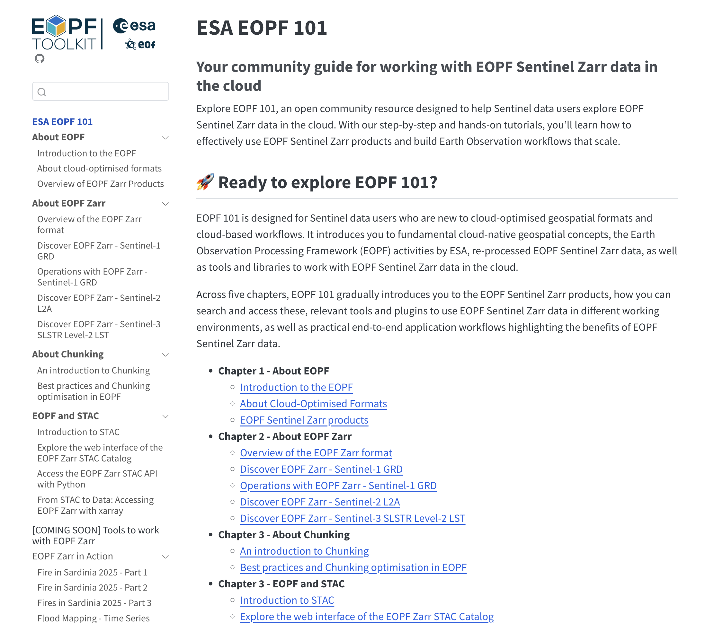
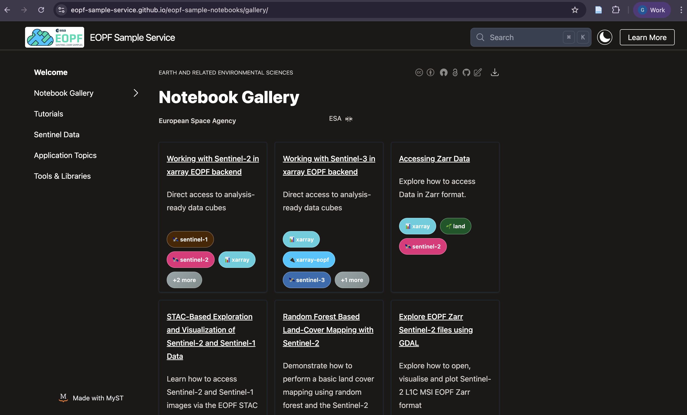

The main aim of this tutorial was to **introduce** you to a **faster** and **more efficient** way of **accessing Sentinel** data. Rather than using traditional downloads, we demonstrated a direct-access, cloud-native approach.

### What we will learned...

- 🔍 What STAC is and why it is a critical community standard.
- 🌳 How to navigate the STAC ecosystem.
- 🔦 How to explore and find data within the **EOPF Sentinel Zarr Samples Service STAC Catalog**.

## Importance of Cloud Optimised Formats

Shifting to **cloud-optimised** formats such as `zarr` is essential for contemporary **Earth Observation** workflows as it significantly reduces latency and computational overhead when accessing data. 

Leveraging this cloud-native data access enables us to achieve **faster and easier response times** for EO workflows, leading to quicker insights and more **agile development cycles**. 

## Missions Integration
Integrating data from multiple sources efficiently is key to accelerating our understanding of the current state of the Earth and enabling more comprehensive analysis. 

## The EOPF STAC Catalog and Data Access

For the **EOPF** initiative, the STAC structure is specifically applied to Sentinel data: 

Adopting the **SpatioTemporal Asset Catalog (STAC)** standard enhances the **replicability** and **reusability** of data within specific workflows, fostering a more collaborative and standardised EO ecosystem.

## The EOPF Zarr Plugins

The EOPF ecosystem provides four plugins that make it easy to access data across different programming languages and platforms:

- **xarray EOPF backend**  
- **xcube EOPF data store**  
- **GDAL EOPF driver**  
- **Julia EOPF reader**  

We encourage you to try them out and share your feedback by opening issues in the respective repositories.

## 💪 Now it is your turn

After this tutorial, we invite you to participate the EOPF Zarr Hackathon tomorrow. If you don't find time, you can visit our resources:

### EOPF 101

Available: [here](https://eopf-toolkit.github.io/eopf-101/)

### EOPF Sentinel Zarr Samples Notebooks

Available: [here](https://eopf-sample-service.github.io/eopf-sample-notebooks/gallery/)

**Challenge yourself with discovering deeper the zarr EOPF format!**

**`Happy zarr Coding! :)`**
